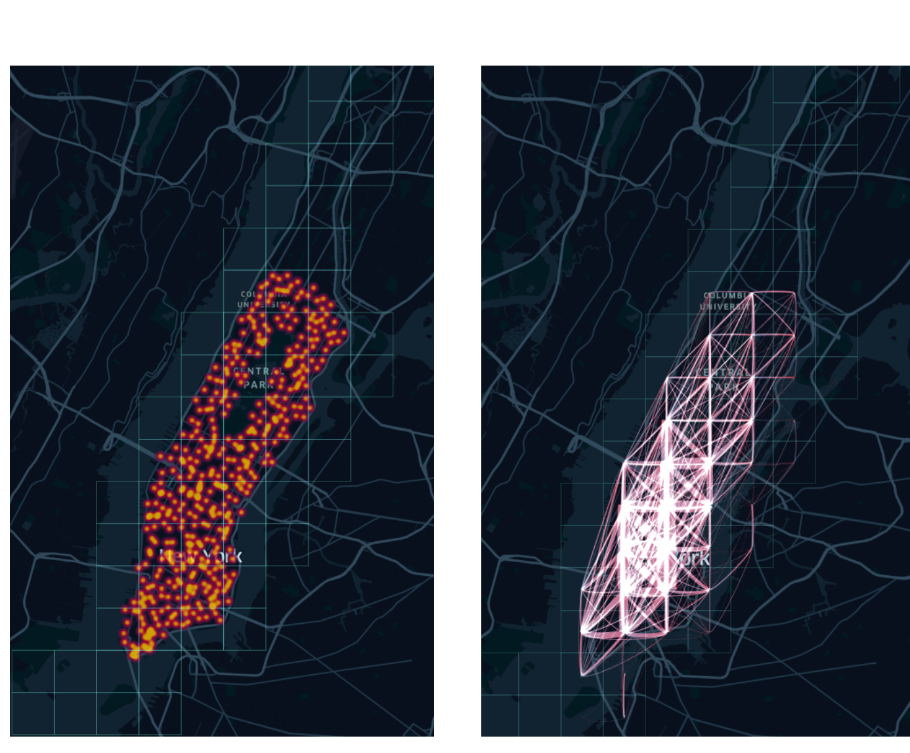
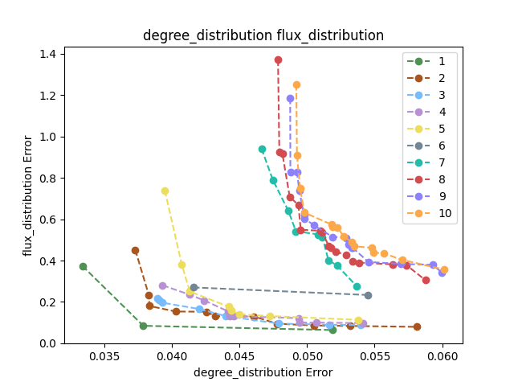

# Genetic algorithms for generation of new mobility networks
This project aims to generate new mobility networks using a *Bio-Inspired* approach. [NSGA II](https://ieeexplore.ieee.org/stamp/stamp.jsp?arnumber=996017) is employed as the main evolutionary algorithm to evolve the networks.
<table>
    <tr>
        <td></td>
        <td></td>
    </tr>
</table>

This project is built on top of two works:
- [Evolving Weighted and Directed Graphs with Constrained
Properties](https://dl.acm.org/doi/pdf/10.1145/3638530.3654350)
- [Generating Mobility Networks with Generative
Adversarial Networks](https://arxiv.org/pdf/2202.11028)

An overview of the project can be found in the report which is available in the repository.

## Installation
First of all, clone our repository and right after that initialize the submodules:
```bash
git clone https://github.com/MattiaRigon/BioMobilityNetworks
git submodule update --init --recursive
```
In this way, [MoGAN](https://github.com/jonpappalord/GAN-flow) repository will be cloned and ready to be used. Then you can install the requirements:
```bash
pip install -r requirements.txt
```

## Datasets
The datasets used in order to initialize the population are the ones used by the authors of MoGAN. They are available on the path `GAN-flow/[dataset_name]/v_train.txt`. The dataset names are:
- `BikeNYC`
- `BikeCHI`
- `TaxiNYC`
- `TaxiCHI`

For further information about the datasets, please refer to the [MoGAN repository](https://github.com/jonpappalord/GAN-flow).

## Usage
Firstly, you need to make sure that the dataset you want to use has a corresponding .pkl file in the `data/preprocessed` folder. If it does not exist, you can create it by running the following command:
```bash
python data/data_loader.py <dataset_name>
```
where `<dataset_name>` is the name of the dataset you want to use.

### Evolution

Then you can run the main script by giving a configuration file as input following the format of the other config file in the `config` folder. For example:
```bash
python main.py config/config_taxi_nyc.json
```
### Evaluation
In order to evaluate the results of the evolution, you can run the following command:
```bash
python analysis.py <path_to_experiment>
```
where `<path_to_experiment>` is the path to the folder containing the results of the evolution (it is defined in the configuration file).

### Running multiple experiments
If you want to run multiple experiments, you can use the `run_all.py` script. You can define the experiments passing a folder containing the configs for the different experiments. For example:
```bash
python run_all.py config/
```
where the `config` folder contains the configuration files for the different experiments.

### Custom optimization
If you want to run an optimization of different metrics or with different constraints, you can create a new property and define it in the `graph_evolution/eval_functions.py` file. Then you can follow the implementation in the `reference_metrics.py` file in order to get the target values for the new property. Finally, you can define the new property in the configuration file and run the optimization.


# Authors
- [Amir Gheser](https://github.com/rogergheser)
- [Mattia Rigon](https://github.com/MattiaRigon)
- [Matteo Mascherin](https://github.com/MatteoMaske)
